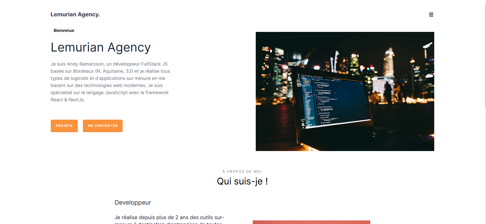

# Lemurian Agency 🇫🇷

[Pre-prod](lemurian-agency.vercel.app)   
[Production](service.andyramaroson.com)

------------------------------------------------

Projet Création de site web Développer avec NextJs | React  

**Presentation du service**

<kbd></kbd>

> PROBLEMATIQUE
Andy Ramaroson est un développeur Freelance qui débute et qui souhaite présenter son activité et ses différents services dans un site internet. Il souhaiterait aussi crée un blog qui l'alimenterait avec des article concernant des technologies actuelle comme IA, ...

> BESOIN
Création du site avec une stack complète en JavaScript avec Nextjs et React.

## Livrables

> React App
- code           : [Github](https://github.com/AndyRama/Lemurian_Agency)
- production     : [vercel](service.andyramaroson.com)

## Compétences développées

- [x] Initialiser une application web avec un framework Nextjs
- [x] Créer des composants avec React 
- [x] Créer des différentes pages de l'application 
- [x] Utilisation de librairie externe 
- [x] création de test 

## Ressources

- maquette       : [Figma](https://www.figma.com/file/9VjWT92jDvr5zQaWRCk7Og/)
- Tableau        : [Trello](https://trello.com/b/jvjMUXfr/lemurian-agency)

### Editeur recommandé

* [Visual Studio code](https://code.visualstudio.com/)

### Prérequis

* [Git](https://git-scm.com/) pour cloner les repos
* [NodeJS](https://nodejs.org/fr/) (version 18.18.1) pour exécuter les commandes
* [Npm](https://www.npmjs.com/) (version 6.14.17) pour lancer l'application (front-end)

### Dépendances

* [NextJs](https://nextjs.org/) (version 13.5.6)
* [React](https://legacy.reactjs.org/) (version 18)

* [Tailwind](https://www.npmjs.com/package/prop-types) (version 3.3.0)

* [React-icon](https://www.npmjs.com/package/react-icons) (version 5.0.1)
* [Contentlayer](https://www.npmjs.com/package/contentlayer) (version 0.3.4)
* [Framer-motion](https://www.npmjs.com/package/framer-motion) (version 11.0.8)
* [Swipper](https://www.npmjs.com/package/swiper/v/11.0.3) (version 11.0.3)
* [date-fns](https://www.npmjs.com/package/date-fns) (version 3.3.1)

* [Eslint](https://www.npmjs.com/package/eslint) (version 8.57.0)
* [Prettier](https://www.npmjs.com/package/prettier) (version 3.2.5)

* [Jest](https://www.npmjs.com/package/jest/v/29.6.4) (version 29.6.4)

### Etape: Lancement du project

- Cloner le repo du projet : `gh repo clone AndyRama/Lemurian_Agency`
- Aller dans ce dossier : `cd Lemurian_Agency `
- Installer ses dépendances : `npm install`
- Le lancer sur le port 3000 : `npm run dev`
- Ouvrez [http://localhost:3000](http://localhost:3000) pour l'afficher dans votre navigateur.

## Fonctionnalité

- [x] Construire le déploiement de l'application

---------------------------

 # Lemurian Agency 🇬🇧

[Pre-prod](lemurian-agency.vercel.app)
[Production](service.andyramaroson.com)

------------------------------------------------

Website Creation Project Develop with NextJs | React

**Service presentation**

<kbd></kbd>

> PROBLEMATIC
Andy Ramaroson is a Freelance developer who is just starting out and wants to present his activity and its different services on a website. He would also like to create a blog which would provide him with articles concerning current technologies such as AI, ...

> NEED
Creation of the site with a complete stack in JavaScript with Nextjs and React.

## Deliverables

> ReactApp
- code: [Github](https://github.com/AndyRama/Lemurian_Agency)
- production: [vercel](service.andyramaroson.com)

## Skills developed

- [x] Initialize a web application with a Nextjs framework
- [x] Create components with React
- [x] Create different pages of the application
- [x] Use of external library
- [x] test creation

## Resources

- model: [Figma](https://www.figma.com/file/9VjWT92jDvr5zQaWRCk7Og/)
- Board: [Trello](https://trello.com/b/jvjMUXfr/lemurian-agency)

### Recommended editor

* [Visual Studio code](https://code.visualstudio.com/)

### Prerequisites

* [Git](https://git-scm.com/) to clone repos
* [NodeJS](https://nodejs.org/fr/) (version 18.18.1) to execute commands
* [Npm](https://www.npmjs.com/) (version 6.14.17) to launch the application (front-end)

### Dependencies

* [NextJs](https://nextjs.org/) (version 13.5.6)
* [React](https://legacy.reactjs.org/) (version 18)

* [Tailwind](https://www.npmjs.com/package/prop-types) (version 3.3.0)

* [React-icon](https://www.npmjs.com/package/react-icons) (version 5.0.1)
* [Contentlayer](https://www.npmjs.com/package/contentlayer) (version 0.3.4)
* [Framer-motion](https://www.npmjs.com/package/framer-motion) (version 11.0.8)
* [Swipper](https://www.npmjs.com/package/swiper/v/11.0.3) (version 11.0.3)
* [date-fns](https://www.npmjs.com/package/date-fns) (version 3.3.1)

* [Eslint](https://www.npmjs.com/package/eslint) (version 8.57.0)
* [Prettier](https://www.npmjs.com/package/prettier) (version 3.2.5)

* [Jest](https://www.npmjs.com/package/jest/v/29.6.4) (version 29.6.4)

### Step: Launch of the project

- Clone the project repo: `gh repo clone AndyRama/Lemurian_Agency`
- Go to this folder: `cd Lemurian_Agency`
- Install its dependencies: `npm install`
- Run it on port 3000: `npm run dev`
- Open [http://localhost:3000](http://localhost:3000) to view it in your browser.

## Functionality

- [x] Build application deployment
